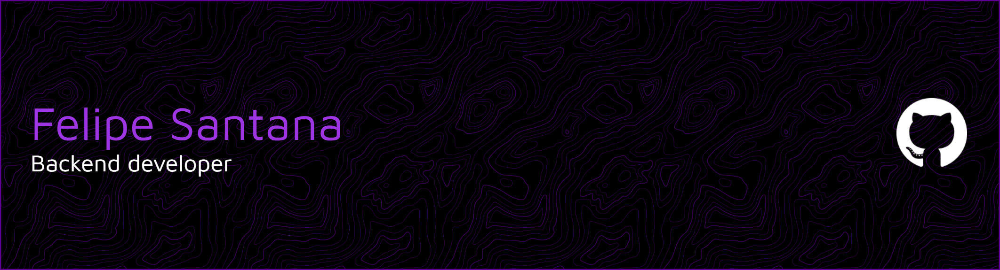

<!-- Banner -->
<h1 align="center">👋 Olá, eu sou o Felipe Santana</h1>
<h3 align="center">Backend Developer | Java & .NET Enthusiast 🚀</h3>

---

## 🚀 Sobre mim
- 💻 Desenvolvedor focado em **Backend**  
- 🎓 Estudante apaixonado por **tecnologia e inovação**  
- 🌱 Atualmente aprendendo **.NET 8, Clean Architecture e Java Spring boot**  
- 📌 Interesse em **Desenvolvimento, Cloud e Inteligência Artificial**  

---

## 🛠️ Tecnologias & Ferramentas

### 💻 Linguagens

### ⚙️ Frameworks & Ferramentas

### ☁️ Cloud & DevOps

---

## 📈 GitHub Stats

  
  

---

## 📂 Projetos em destaque
- 🔥 [stormtrack](https://github.com/FelipeSants08/stormtrack) → Sistema de alertas climáticos em **Java Spring Boot**  
- ⚡ [gsFuturoEnergyPY](https://github.com/FelipeSants08/gsFuturoEnergyPY) → Monitoramento energético em **Python**  
- 🛵 [AgendamentoJava](https://github.com/FelipeSants08/AgendamentoJava) → Sistema de agendamento em **Java**  

---

## 📫 Contato

  
  

